<table align="center"><tr><td align="center" width="9999"><br>


# DOMÓTICA

<b>Instituto Federal de Educação, Ciência e Tecnologia de Santa Catarina<br>
Campus Florianópolis<br>
Departamento Acadêmico de Eletrônica<br>
Projeto Integrador II</b>

*Alexsander Vieira*
</td></tr></table>

<p align="justify">
Domótica é um conceito de integração de dispositivos de automação residencial. Derivado do termo francês Domotique, este termo é uma fusão das palavras "Domous", que significa casa, com "Imoutique", que significa automática.
</p>
<p align="justify">
O conceito de automação residencial inicialmente foi implementado em aplicações de segurança, climatização e iluminação, uma necessidade gerada pelo aumento na quantidade de edificações(Hotéis, Apartamentos, etc), que devido a sua estrutura acabavam necessitando de uma forma de controle centralizada.
</p>
<p align="justify">
Com o passar do tempo este conceito se mostrou muito vantajoso para inúmeras aplicações inclusive Automação Residencial. Esta por sua vez possui o foco em comodidade, conforto e segurança, realizando a automação de eletrônicos dentro de uma residencial, Ex.: aparelhos de som, televisores, luzes, cortinas, portas, janelas, câmeras de segurança, climatização,etc.
</p>
<p align="justify">
Devido a automação residencial se destinar principalmente a ser utilizada pelo consumidor final, alguém que não necessariamente possui grande conhecimento sobre as áreas de elétrica e eletrônica, esta aplicação inicialmente não era tão acessível a grande parte da população. Entretanto com o passar do tempo empresas começaram a perceber o potencial deste mercado e desenvolver produtos focados para o usuário final, com fácil instalação e usabilidade, o que nos últimos anos impulsionou muito este tipo de aplicação.
</p>
<p align="justify">
Por se tratar de um conceito que está cada vez mais popular e possuir uma grande aplicabilidade no dia a dia, o Projeto integrador 2, possui como objetivo a elaboração de um sistema de automação residencial, proporcionando uma grande oportunidade de aplicar os conceitos aprendidos até o presente momento.
</p>

********************************************************
<h2 align="center">Hardware e Componentes</h2>

<p align="justify">
Para realização deste projeto foram disponibilizados os seguintes componentes:
</p>

* Arduino Mega 2560 R3 (Utilização obrigatória);
* Módulo Relé 1 Canal 5V;
* Módulo Sensor de Umidade e Temperatura DHT11 KY-015(Utilização obrigatória);
* Módulo Bluetooth RS232 HC-05(Utilização obrigatória);
* Módulo Buzzer 5V Passivo;
* Sensor de Água;
* Detector de Gás/Sensor de Gás MQ-2(Utilização obrigatória);
* Módulo Matriz de LED 8x8, com MAX7219;
* Sensor de Distância Ultrassônico HC-SR04(Utilização obrigatória);
* Módulo Sensor de Movimento e Presença PIR - HC-SR501(Utilização obrigatória);
* Light Dependent Resistor - LDR;
* Protoboard 830 Pontos;
* Kit Jumpers 10cm x 120 Unidades;
* Fonte DC chaveada 9V/1A e plug P4;
* Multímetro Digital Hikari HM-1001;
* Display LCD 16x2.

<p align="justify">
Avaliando os recursos disponíveis e os requisitos de projeto (itens de utilização obrigatória) foi elaborado um mapa mental da concepção do projeto.
</p>
<p align="justify">
O Mapa Mental permite colocar no papel todas as possibilidades e caminhos disponíveis, facilitando a visualização do projeto como um todo, suas possibilidades de atuação, os requisitos de projeto, possibilitando assim uma orientação mais adequada de qual caminho seguir com a concepção do projeto.
</p>
<p align="justify">
Levando em consideração os recursos disponíveis foi elaborado o mapa com três subdivisões iniciais. Controle, dispositivos de dispositivos de forma automática ou não. Monitoramento, verificação de partes do sistema (sensores por exemplo). Sinalização, interface para com o usuário permitindo visualizar o que está ocorrendo com o sistema.
</p>

<p align="center">
    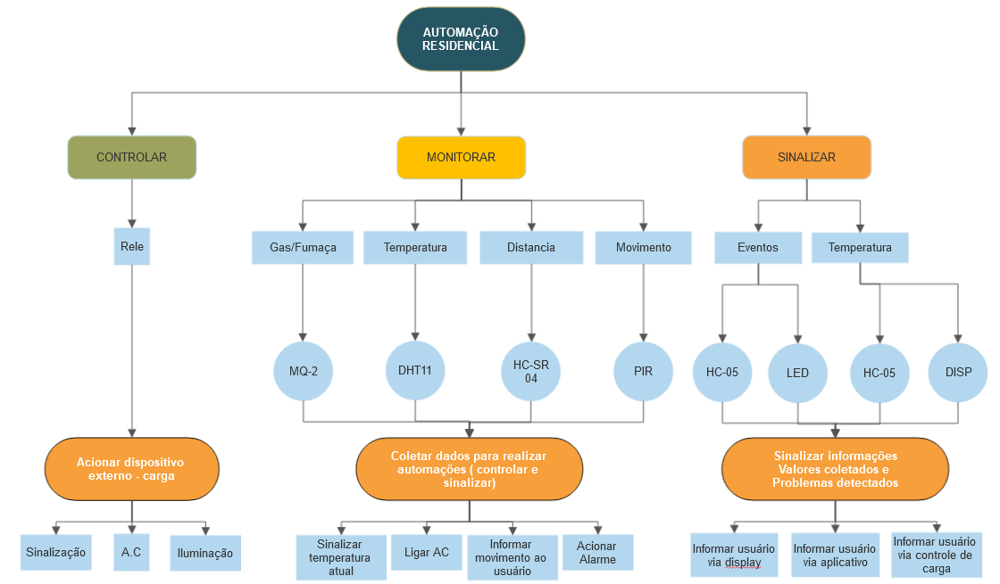
    <br>
    Mapa mental
</p>

<p align="justify">
Com a elaboração do mapa foi possível estabelecer uma linha de raciocínio mais clara do que poderia ser realizado com os recursos disponíveis e dentro do escopo inicial, dando início a etapa de concepção do projeto.
</p>


 

********************************************************
<h2 align="center">C: Concepção</h2>

<p align="justify">
    Levando em consideração as possibilidades levantadas no Mapa Mental, foi decidido pela implantação de uma sistema de monitoramento residencial, com o objetivo de monitorar aspectos de conforto e segurança do ambiente enquanto o usuário estiver no ambiente. Avaliando o mapa mental é possível verificar que a única limitação para que esta implementação não possa ser estendida para quando o usuário não estiver no ambiente fica por por parte da subdivisão de sinalização, por não possuir um módulo de comunicação internet (wifi ou cabeado) a aplicação fica limitada ao alcance do módulo bluetooth, por este motivo as aplicações selecionadas visam predominantemente informações que o usuário gostaria de receber estando presente no local.
</p>
<p align="justify">
    O projeto possuirá 1 módulo passivo e um módulo automático. O módulo automático ficará responsável pela coleta de dados dos dispositivos a serem monitorados (gás/fumaça, Temperatura, abertura, Movimento) estas informações serão utilizadas para tomadas de decisões automatizadas ou por parte do usuário(Monitoramento e Sinalização). O módulo Passivo será composto por uma interface com usuário, via aplicativo, nesta interface serão apresentados os status dos sensores utilizando as informações coletadas pelo módulo automático e o acionamento manual do dispositivo controlado, nesta interface estarão disponíveis especificamente as informações a seguir:
</p>

* Sinalização de temperatura no ambiente;
* Seletor de temperatura máxima desejada;
* Sinalização de umidade no ambiente;
* Seletor de humildade mínima desejada;
* Sinalização de temperatura indevida;
* Sinalização de umidade indevida;
* Sinalização de movimento detectado;
* Sinalização de fossa próxima do limite, possibilitando um aviso antes que isso * possa trazer inconvenientes para o usuário.
* Sinalização de vazamento de gás;

<p align="justify">
O módulo automático conforme mencionado anteriormente ficará responsável por realizar o monitoramento de sensores e acionamentos de dispositivos, mais especificamente os itens descrito a seguir:
</p>

* Monitoramento do movimento em uma área sensível da residência, uma entrada, um corredor,  uma janela, algum ponto do ambiente que o usuário acredite representar um possível acesso vulnerável ao ambiente;
* Monitoramento de temperatura automático do ambiente;
* Monitoramento de umidade automático do ambiente;
* Monitoramento do nível da fossa;
* Monitoramento de vazamento de gás;
* Acionamento de um Giroflex para sinalização de eventos;

********************************************************
<h2 align="center">D: Design</h2>

<p align="justify">
Considerando os requisitos estipulados na na concepção foi realizado o design do projeto, a primeira versão foi criada apenas levando em consideração o conhecimento básico dos dispositivos e das conexões necessárias.
</p>

<p align="center">
    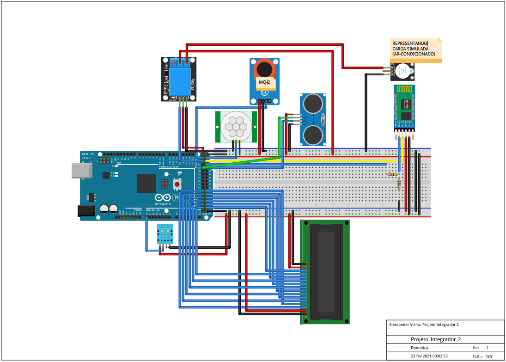
    <br>   
    Design versão 1
</p>

<p align="justify">
Durante a etapa de implementação foram verificadas que alguns pontos não estavam especificados corretamente, alguns por causarem dificuldade na montagem, outros por não funcionarem corretamente. Sendo assim o design sofreu algumas alterações, a seguir o design final.
</p>

<p align="center">
    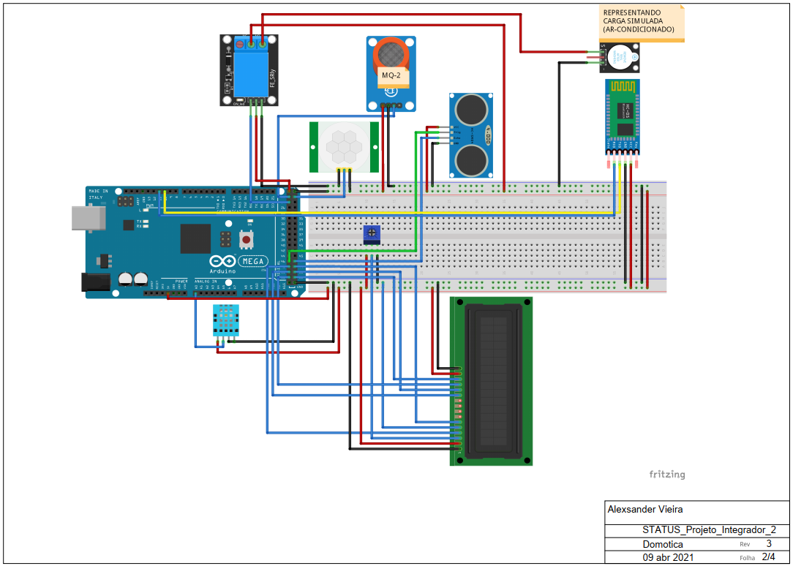
    <br>   
    Design final
</p>

<p align="center">
    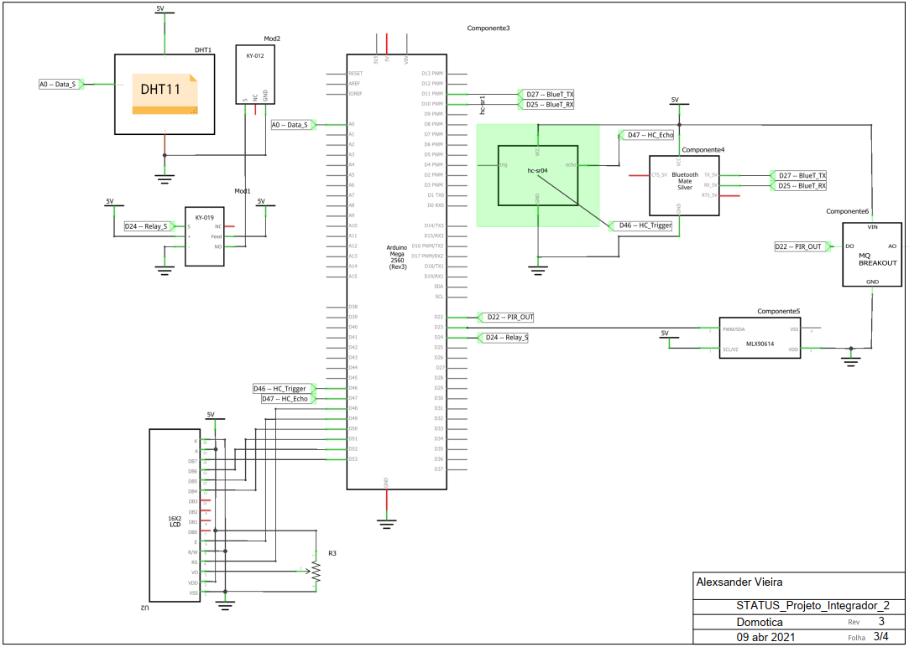
    <br>   
    Design final, esquemático
</p>


<p align="justify">
    As principais alterações efetuadas no design são:
</p>


* Alteração do método de comunicação com o display, redução para 4 vias de dados;
* Adição do trimpot para regular o brilho do display;
* Alteração das portas de comunicação com o sensor ultrasonico, alterado para * facilitar a montagem;
* Correção da montagem do módulo bluetooth, ligação inicial não funcionou corretamente.

<p align="justify">
    Mais detalhes sobre essas alterações serão abordados no tópico seguinte, Implementação.
</p>

********************************************************
<h2 align="center">I: Implementação</h2>

<p align="justify">
    Nesta etapa foi realizada a montagem de cada parte do circuito e elaborado o código para que o Arduino Mega 2560 r3, disponibilizado com o kit,  possa realizar as funções especificadas durante a concepção do projeto (módulos passivo e automático).
</p>

<p align="center">
    
    <br>   
    Arduino Mega 2560 r3
</p>

<h3>Sensor de movimento</h3>

<p align="justify">
    Para a implementação do sensor de movimento foi utilizado o sensor PIR HC-SR501, este sensor é capaz de detectar movimento de objetos que exalam calor e que esteja dentro seu alcance que pode ser regulado entre 3 e 7 metros, devido a essa característica ele possui os requisitos necessário para monitorar o movimentos próximos a pontos específicos(uma entrada, uma janela, um pequeno corredor, etc).
</p>

<p align="center">
    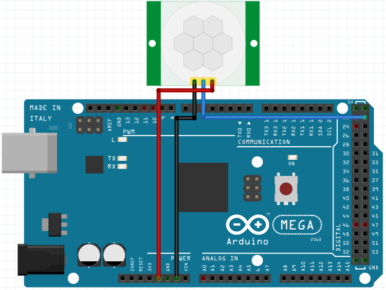
    <br>   
    Implementação sensor  de movimento PIR HC-SR501
</p>

<h3>Sensor de nivel</h3>

<p align="justify">
    Para a implementação do sensor de nível de fossa foi utilizado o sensor Sensor ultrasonico HC-SR04, este sensor é composto de emissor e um receptor ultrassônico, este dispositivo possui a capacidade de emitir um sinal ultrassônico e ao medir o tempo de reflexão deste sinal é possível estimar a distância de objetos em um ângulo de ± 15 graus a frente no sensor.<br>
    Este sensor é mais indicado para detectar superfícies metálicas, entretanto também é possível utilizá lo para detectar outras superfícies, inclusive líquidos, por este motivo ele foi utilizado para monitorar a distância entre o sensor e a uma superfície líquida (fossa), para que quando esta superfície chegar a 30cm ou menos o usuário possa ser alertado.

</p>

<p align="center">
    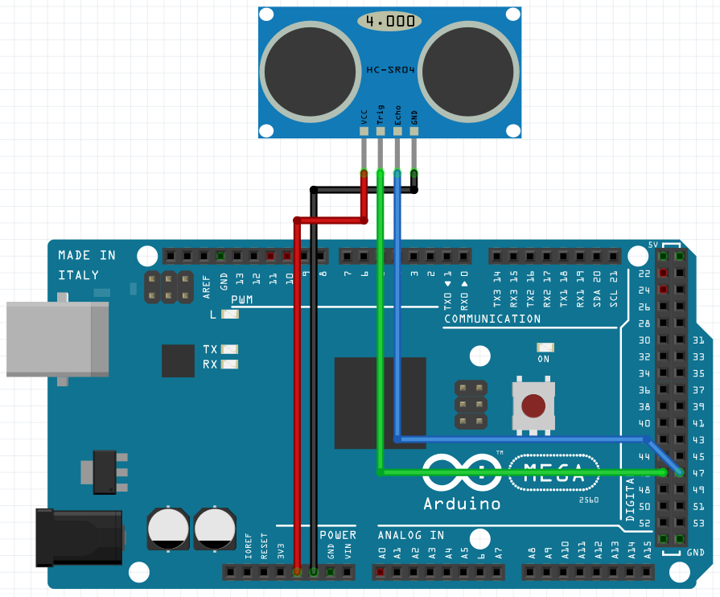
    <br>   
    Implementação sensor  de movimento PIR HC-SR501
</p>

<h3>Sensor de temperatura e humidade</h3>

<p align="justify">
    Para a implementação dos sensores de temperatura e umidade foi utilizado o dispositivo DHT11, este dispositivo possui uma implementação bem simplificada e é capaz de realizar medições de temperatura de 0º até 50º celsius e umidade do ar nas faixas de 20% a 90% com uma precisão aceitável para aplicação em questão ( 2º temperatura e 5% humidade).
</p>

<p align="center">
    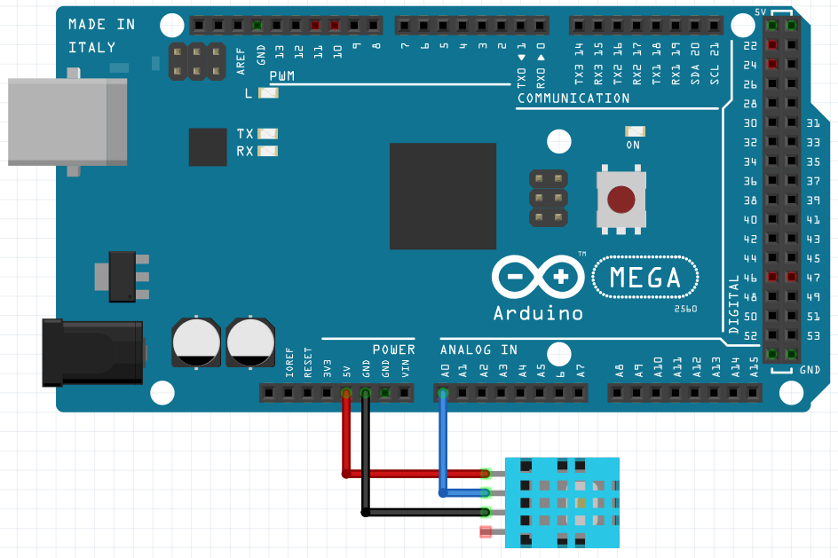
    <br>   
    Implementação sensor DHT11
</p>

<h3>Sensor de vazamento de gás</h3>

<p align="justify">
    Para a implementação do sensor de vazamento de gás foi utilizado o módulo eletrônico MQ-2 desenvolvido com a finalidade de detectar a presença de gás inflamável / fumaça em determinado ambiente.
</p>

<p align="center">
    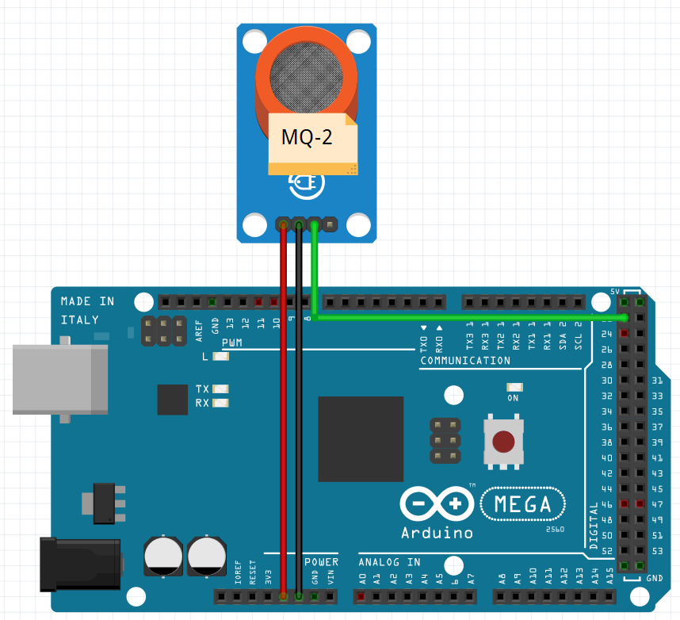
    <br>   
    Implementação sensor de vazamento de gás, MQ-2
</p>

<h3>Acionamento de carga externa</h3>

<p align="justify">
    Para a implementação do acionamento de carga externa foi utilizado o módulo de relé, este módulo permite fechar o circuito de carga, chaveando a alimentação do giroflex, perante a utilização de um sinal de nível lógico digital do arduino. Este acionamento poderia ser utilizado para realizar um alerta para qualquer um dos monitoramentos realizados neste projeto, por questão de criticidade, foi decidido utilizar o giroflex como alerta para um possível vazamento de gás.
</p>

<p align="center">
    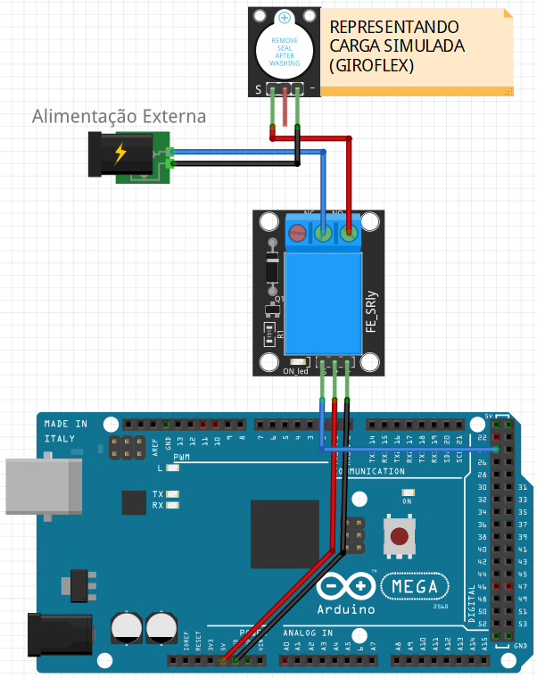
    <br>   
    Implementação acionamento de Giroflex
</p>

<p align="justify">
    Esta é uma aplicação viável entretanto em uma aplicação real seria necessário levar em conta o posicionamento desse itens, por questões de segurança este módulo não deveria estar fisicamente próximo ou no mesmo ambiente que se está monitorando o vazamento de gás, isto se deve ao fato de que ao realizar o fechamento do contato do relé é possível e muito comum que ocorram fagulhas devido a aproximação repentina de duas superfícies com níveis de tensão diferente (contato das chapas metálicas do relé durante seu acionamento.<br>
    Esta estratégia de acionamento de cargas externas poderia ser utilizada para as outras aplicações monitoradas no projeto ao atualizar mais módulos de relé ou ao utilizar um módulo com múltiplos relés.
</p>

<p align="center">
    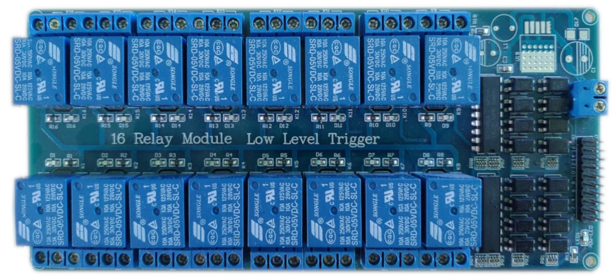
    <br>   
    Módulo com 16 relés
</p>

<h3>Display 16x2</h3>

<p align="justify">
    A comunicação com o display 16x2 foi realizada como uma forma secundária de possuir acesso aos dados colhidos pelo sistema, durante a implementação foi verificado que a biblioteca disponível para o arduino possui um otimização que permite a transferência de dados utilizando apenas 4 vias, ao contrário do padrão 8 vias, neste projeto essa alternativa foi utilizada apenas para reduzir o número de fios conectados ao sistema, entretanto em outras situações isso pode ser demonstrar muito útil ao liberar 4 entradas/saídas de nível lógico digital que podem ser utilizadas para aplicações distintas.
</p>

<p align="center">
    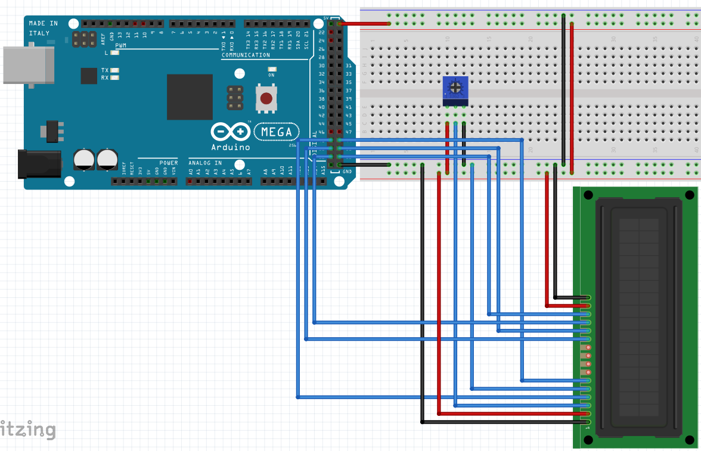
    <br>   
    Implementação display 16x2
</p>

<h3>Comunicação Bluetooth</h3>

<p align="justify">
    O módulo bluetooth HC-05 foi utilizado para realizar transferência de informações entre o sistema e o aplicativo desenvolvido na plataforma Blynk para Android, possibilitando assim uma interface para o acesso do usuário onde ele pode verificar o status dos sistemas e realizar as configurações necessárias.
</p>

<p align="center">
    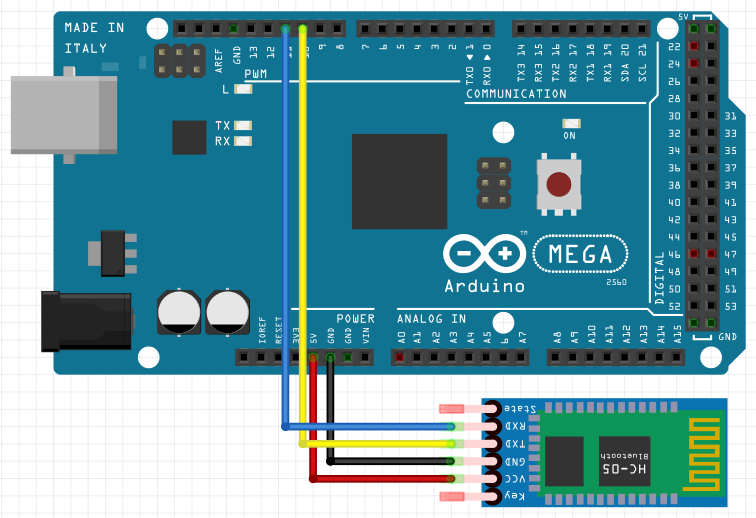
    <br>   
     Implementação módulo bluetooth
</p>

<h3>Programação arduino</h3>

<p align="justify">
    O código abaixo representa a implementação realizada para comunicação com os dispositivos anteriormente apresentados e para comunicação com a aplicação criada na plataforma Blynk.
</p>

``` c++
/*
  Projeto Integrador 2 - Domotica
  Alexsander Vieira
*/

#define BLYNK_PRINT Serial

// include - Bibliotecas utilizadas:
#include <LiquidCrystal.h>          // Biblioteca de comunicação do display LCD
#include <dht.h>                    // Biblioteca DHT1
#include "Ultrasonic.h"             // Biblioteca sensor HC-SR04
#include "SoftwareSerial.h"         // Biblioteca serial - Bluetooth
#include <BlynkSimpleSerialBLE.h>   // Biblioteca serial - Blynk


// Associando pinos do LCD
const int rs = 48, en = 49, d4 = 50, d5 = 51, d6 = 52, d7 = 53;   // Passo efetuado apenas para otimizar visualização/organização
LiquidCrystal lcd(rs, en, d4, d5, d6, d7);

// Associando pino PIR
const int pinoPIR = 23;                                           //PINO SENSOR DE PRESENÇA

// Associando pino DHT!
const int pinoDHT11 = A0;                                         //PINO  DHT11
dht DHT;                                                          //VARIÁVEL DO TIPO DHT

// Associando sensor HC-SR04
const int echoPin = 47;                                           //PINO DIGITAL UTILIZADO PELO HC-SR04 ECHO(RECEBE)
const int trigPin = 46;                                           //PINO DIGITAL UTILIZADO PELO HC-SR04 TRIG(ENVIA)
Ultrasonic ultrasonic(trigPin,echoPin);                           //INICIALIZANDO OS PINOS DO ARDUINO

// Associando pino sensor gas
const int pinoSensor = 22;                                        //PINO DIGITAL UTILIZADO PELO SENSOR

// Associando pino saída relê
const int pinoRele = 24;                                          //PINO DIGITAL UTILIZADO PELO MÓDULO RELÉ

// Associando pino Bluetooth
SoftwareSerial bt(10, 11);                         //PINOS QUE EMULAM A SERIAL, ONDE O PINO 2 É O RX E O PINO 3 É O TX

//Variaveis gerais
int DHT_checktime = 0;          // utilizado para medir intervalo de leitura do DHT
int distancia;                  // utilizado durante leitura da distancia, HC-SR04 
String result;                  // utilizado para receber resultado da função de calculo de distancia, HC-SR04 
char auth[] = "jESia9UZqKpPymXCriFZXUMofHbRyHT4";
BlynkTimer timer;
WidgetLED led1(V0); //LED de exibição do monitoramento de gás
WidgetLED led2(V1); //LED de exibição do monitoramento de umidade
WidgetLED led3(V2); //LED de exibição do monitoramento de temperatura
WidgetLED led4(V3); //LED de exibição do monitoramento de movimento
WidgetLED led5(V4); //LED de exibição do monitoramento de fossa
int temp_max =0;
int umid_min =0;

void setup() {
  // put your setup code here, to run once:
  pinMode(pinoPIR, INPUT); //DEFINE O PINO COMO ENTRADA

  lcd.begin(16, 2);
  lcd.print("Projeto 2!");

  pinMode(echoPin, INPUT);  //definindo pino como estrada para o sinal echo
  pinMode(trigPin, OUTPUT); //definindo pino como saída para o sinal echo

  Serial.begin(38400);       //INICIALIZA A PORTA SERIAL
  bt.begin(38400);    //INICIALIZA A SERIAL DO BLUETOOTH
  Blynk.begin(bt, auth); 
  Serial.println("Aguardando por conexão...");

  pinMode(pinoSensor, INPUT); //definindo pino entrada sensor gas

  pinMode(pinoRele, OUTPUT); //definindo pino como saída para o sinal do relê
  digitalWrite(pinoRele, HIGH); //definindo inicio do rele, desligado

  led1.off();
  led2.off();
  led3.off();
  led4.off();
  led5.off();
  //Blynk.setProperty(V0,"color","D3435C");  Removido, pois aparentemente aplicativo não reconheceu o comando
}


void loop() {
  // put your main code here, to run repeatedly:
  Blynk.run();
  
  if ((DHT_checktime - (millis() / 1000))>5) {
    DHT.read11(pinoDHT11);
    lcd.setCursor(0, 0);
    lcd.print("U:");
    lcd.print(DHT.humidity);
    lcd.print(" T:");
    lcd.print(DHT.temperature, 0);
    DHT_checktime= (millis() / 1000);
    Blynk.virtualWrite(V5, DHT.humidity); 
    Blynk.virtualWrite(V6, DHT.temperature);    
  }

  hcsr04(); // FAZ A CHAMADA DO MÉTODO "hcsr04()"
  lcd.setCursor(5, 1);
  lcd.print("     ");
  lcd.setCursor(5, 1);
  lcd.print(result);
  lcd.print("cm");

  //monitorando sensor de movimento
  lcd.setCursor(0, 1);
  if(digitalRead(pinoPIR) == HIGH){ //SE A LEITURA DO PINO FOR IGUAL A HIGH, FAZ
    lcd.print("ON "); //Movimento detectado
    led4.on(); 
 }else{ //SENÃO, FAZ
    lcd.print("OFF"); //Movimento ñ detectado
    led4.off();
  }

  //monitorando sensor de fossa
  lcd.setCursor(14, 0);
  lcd.print(result.toInt());

  if(result.toInt() < 30){ //SE A LEITURA DO PINO FOR IGUAL A HIGH, FAZ 
    led5.on(); 
  }else{ //SENÃO, FAZ  
    led5.off();
  }

  //monitorando sensor de temperatura

  //lcd.setCursor(14, 0);
  //lcd.print(temp_max);
  if(DHT.temperature > temp_max){ //SE A LEITURA DO PINO FOR IGUAL A HIGH, FAZ
    //lcd.print("1");  
    led3.on(); 
 }else{ //SENÃO, FAZ
    //lcd.print("0");  
    led3.off();
  }

  //monitorando sensor de umidade
  //lcd.setCursor(14, 0);
  if(DHT.humidity < umid_min){ //SE A LEITURA DO PINO FOR IGUAL A HIGH, FAZ
    //lcd.print("1");  
    led2.on(); 
  }else{ //SENÃO, FAZ
    //lcd.print("0");  
    led2.off();
  }
 
 //monitorando sensor de gas
 lcd.setCursor(11, 1);
 if(digitalRead(pinoSensor) == LOW){ //SE A LEITURA DO PINO FOR IGUAL A LOW, FAZ
    lcd.print("ON "); //gas detectado
    led1.on();
    digitalWrite(pinoRele, LOW); //LIGA O MÓDULO RELÉ (LÂMPADA ACENDE)
  }else{ //SENÃO, FAZ
    lcd.print("OFF"); //gas ñ detectado
    led1.off();
    digitalWrite(pinoRele, HIGH); //DESLIGA O MÓDULO RELÉ (LÂMPADA APAGA)
  }

}

//MÉTODO RESPONSÁVEL POR CALCULAR A DISTÂNCIA
void hcsr04(){
    digitalWrite(trigPin, LOW); //SETA O PINO 46 COM UM PULSO BAIXO "LOW"
    delayMicroseconds(2); //INTERVALO DE 2 MICROSSEGUNDOS
    digitalWrite(trigPin, HIGH); //SETA O PINO 46 COM PULSO ALTO "HIGH"
    delayMicroseconds(10); //INTERVALO DE 10 MICROSSEGUNDOS
    digitalWrite(trigPin, LOW); //SETA O PINO 46 COM PULSO BAIXO "LOW" NOVAMENTE
    //FUNÇÃO RANGING, FAZ A CONVERSÃO DO TEMPO DE
    //RESPOSTA DO ECHO EM CENTIMETROS, E ARMAZENA
    //NA VARIAVEL "distancia"
    distancia = (ultrasonic.Ranging(CM)); //VARIÁVEL GLOBAL RECEBE O VALOR DA DISTÂNCIA MEDIDA
    result = String(distancia); //VARIÁVEL GLOBAL DO TIPO STRING RECEBE A DISTÂNCIA(CONVERTIDO DE INTEIRO PARA STRING)
    delay(250); //INTERVALO DE 500 MILISSEGUNDOS
 }

//MÉTODO RESPONSÁVEL POR passar o valor do seletor de temperatura
BLYNK_WRITE(V8) //Botão que fará o acionamento manual do relé/válvula pelo usuário do app
{
  temp_max = param.asInt(); 
}

//MÉTODO RESPONSÁVEL POR passar o valor do seletor de umidade
BLYNK_WRITE(V7) //Botão que fará o acionamento manual do relé/válvula pelo usuário do app
{
  umid_min = param.asInt(); 
}
```
<h3>Interface com usuário - Blynk</h3>

<p align="justify">
    A interface com usuário criada no Blynk ficou conforme a Figure a seguir.
</p>

<p align="center">
    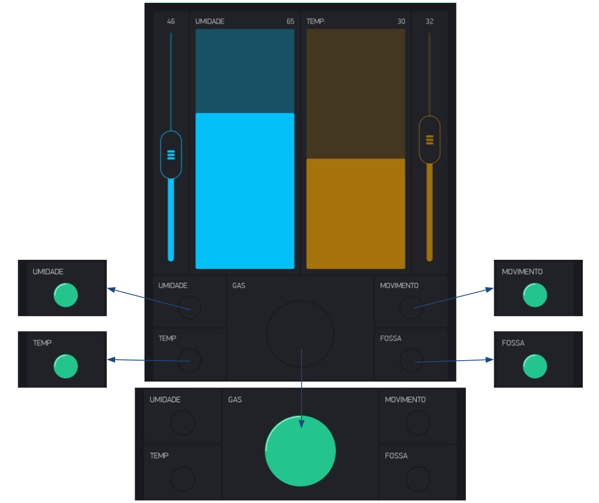
    <br>   
    Interface com usuário
</p>

<p align="justify">
    Principais características da interface:
</p>

* Mostrador de umidade atual, barra central azul na parte superior da interface;
* Seletor de umidade mínima desejada, slider azul localizado no canto superior da interface. Este seletor permite ao usuário definir o valor mínimo desejado, este valor é enviado ao sistema para ser avaliado durante os acionamentos;
* Mostrador de temperatura atual, barra central laranja na parte superior da interface;
* Seletor de temperatura máxima desejada, slider laranja localizado no canto superior da interface. Este seletor permite ao usuário definir o valor máximo desejado, este valor é enviado ao sistema para ser avaliado durante os acionamentos;
* Sinalização de temperatura indevida, indicador canto inferior esquerdo;
* Sinalização de umidade indevida, indicador canto inferior esquerdo;
* Sinalização de movimento detectado, indicador canto inferior direito;
* Sinalização de fossa próxima do limite, indicador canto inferior direito;
* Sinalização de vazamento de gás, indicador central;


********************************************************
<h2 align="center">O: Operação</h2>

<p align="center">
    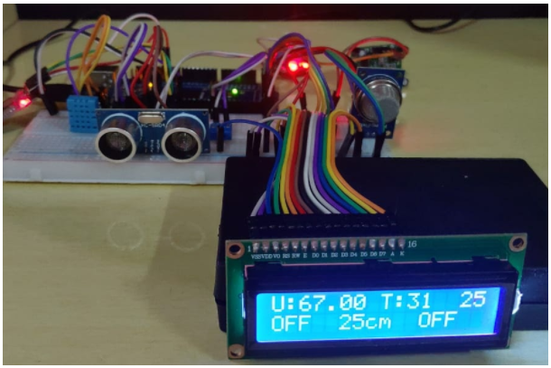
    <br>   
    Interface com usuário
</p>

<p align="center">
    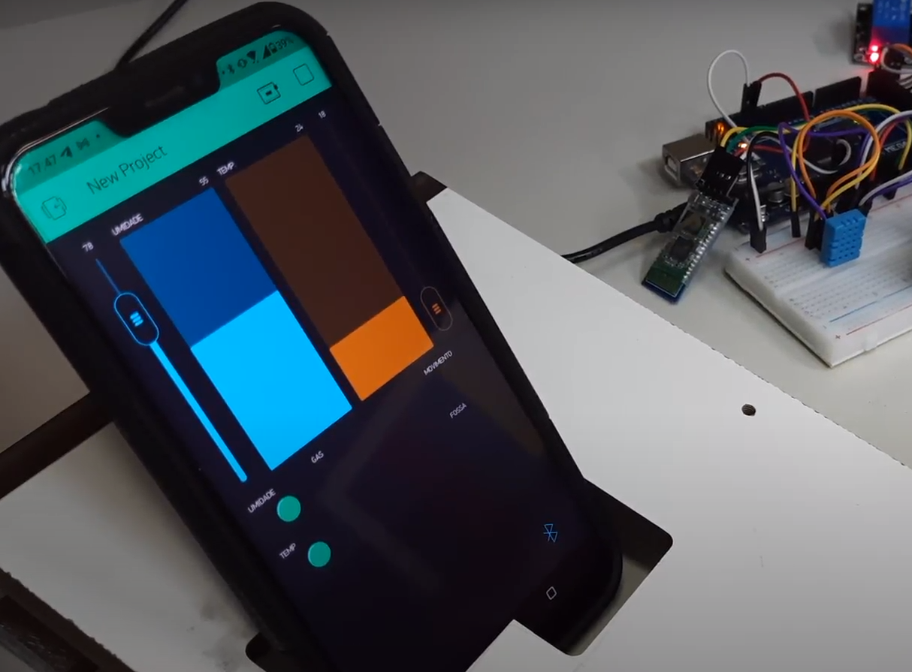
    <br>   
    Interface com usuário
</p>


********************************************************
<h2 align="center">Conclusões</h2>


<p align="justify">
    Acredito ter sido uma experiência muito produtiva onde foi possível aplicar vários conceitos visualizados em outras matérias de forma prática. Também é importante verificar que mesmo não conhecendo todos os módulos ou a linguagem de programação que seria utilizada no projeto utilizando os conhecimentos adquiridos no curso até o momento e um pouco de pesquisa e dedicação foi possível analisar a situação problema, os recursos disponíveis e projetar algo que resolvesse de forma satisfatória os problemas apresentados.
</p>


********************************************************
<h2 align="center">Agradecimentos</h2>

<p align="justify">
    Gostaria de agradecer aos nobres colegas de classe que por diversas vezes ajudaram a tirar dúvidas sobre implementações e sobre o andamento da disciplina que devido a pandemia e de limitações com relação ao horário no trabalho não pude acompanhar tão ativamente como gostaria. Gostaria de agradecer também aos professores pela qualidade do material disponibilizado, o que possibilitou acompanhar a matéria e tirar dúvidas mesmo com as dificuldades de horário encontradas. Por último gostaria de agradecer ao professor Fernando Pedro Henrique de Miranda pela indicação do trabalho colega de curso Guilherme da Costa Franco, que participou desta unidade curricular em 2020/01 sua excelente documentação das etapas de projeto possibilitaram superar a principal dificuldade do projeto e corrigir problemas de  implementação do módulo de comunicação bluetooth.
</p>

********************************************************
<h2 align="center">Referências</h2>

FRANCO, Guilherme da Costa. Concepção do projeto: Sistema de Irrigação Automatizado.<br> Disponível em: <https://github.com/LPAE/pi2_eng_20_1/blob/master/GUILHERME/GUILHERME.md/>. <br>Acesso em: 24 abril. 2021.<br>

MASTERWALKERSHOP. Módulo Sensor de Umidade e Temperatura DHT11 KY-015. <br>Disponível em:<https://blogmasterwalkershop.com.br/arduino/como-usar-com-arduino-modulo-sensor-de-umidade-e-temperatura-dht11/>.<br> Acesso em: 24 abril. 2021.<br>

MASTERWALKERSHOP. Detector de Gás/Sensor de Gás MQ-2 <br>
Disponível em:<https://blogmasterwalkershop.com.br/arduino/como-usar-com-arduino-sensor-detector-de-gas-inflamavel-fumaca-mq-2/>.
<br> Acesso em: 24 abril. 2021.<br>

MASTERWALKERSHOP. Sensor de Obstáculo Infravermelho IR. <br>
Disponível em:<https://blogmasterwalkershop.com.br/arduino/como-usar-com-arduino-sensor-infravermelho-reflexivo-de-obstaculo/>. <br>
Acesso em: 24 abril. 2021.<br>

MASTERWALKERSHOP. Módulo Sensor De Movimento e Presença PIR - HC-SR501. <br>Disponível em:<https://blogmasterwalkershop.com.br/arduino/como-usar-com-arduino-sensor-pir-detector-de-movimento/>. <br>
Acesso em: 24 abril. 2021.<br>

INSTITUTO FEDERAL DE SANTA CATARINA. Benchmarking & CDIO <br>
Disponível em:<http://sites.florianopolis.ifsc.edu.br/cdio/>. <br>
Acesso em: 24 abril. 2021.<br>

MINDMAPPING. How To Make a Mind Map. <br>
Disponível em:<https://www.mindmapping.com/>. <br>
Acesso em: 24 abril. 2021.<br>
