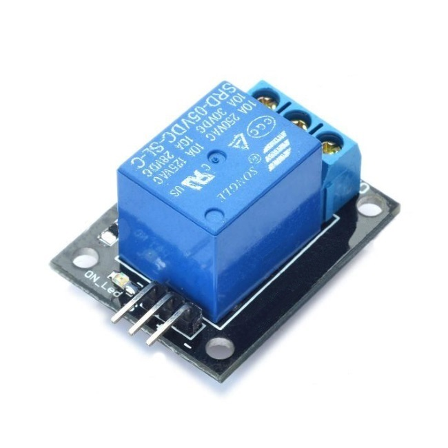
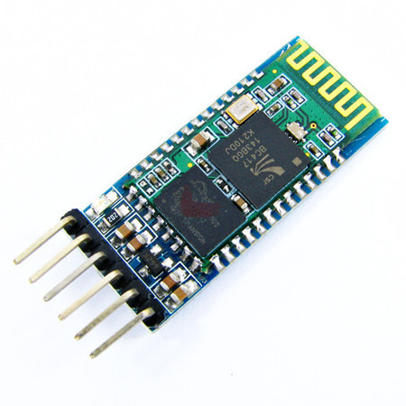
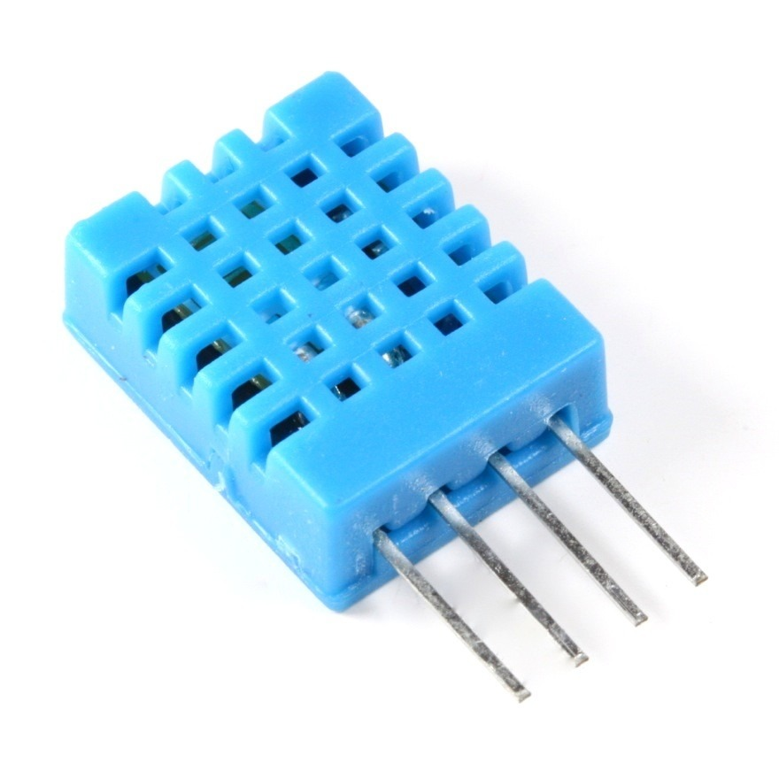
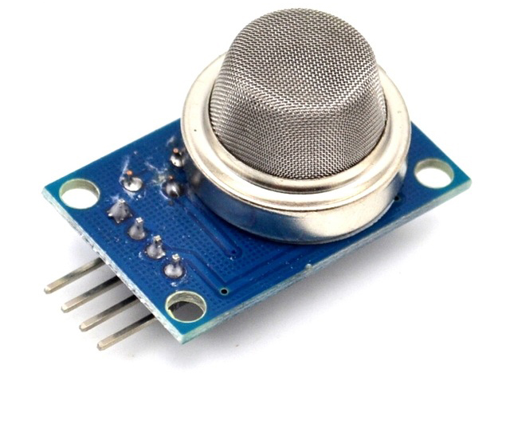
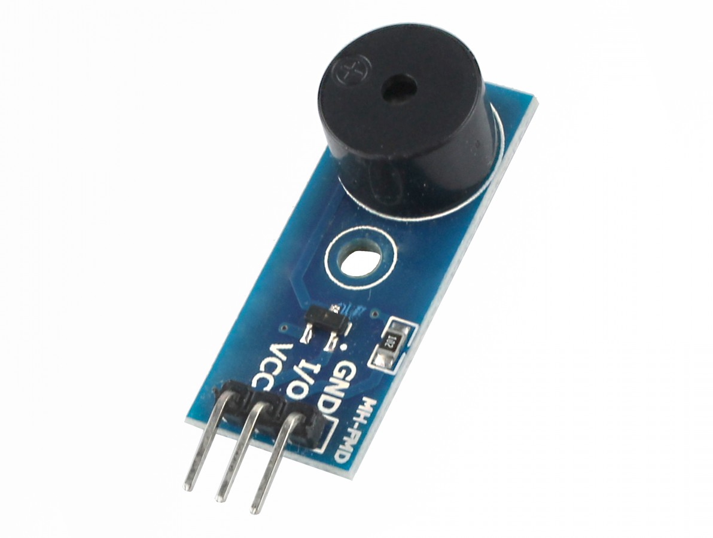
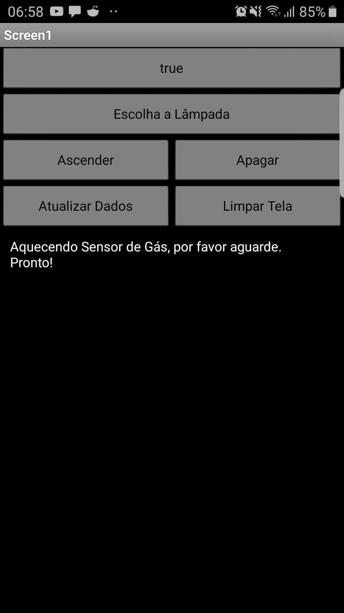

<table align="center"><tr><td align="center" width="9999"> 

# Automação Residencial e Acessibilidade com Arduino

<b>Instituto Federal de Educação, Ciência e Tecnologia de Santa Catarina 
Campus Florianópolis 
Departamento Acadêmico de Eletrônica 
Projeto Integrador II</b>

*Kenner Marqueti Couto*
</td></tr></table>

O mercado de domótica vem em crescente expansão, tendo se popularizado entre hobbistas com a ascendência das plataformas de prototipagem acessíveis como o Arduino, e recentemente vendo a chegada de grandes empresas ao ramo, como no caso da integração de dispositivos da Amazon como o Echo Dot, com lâmpadas e alto falantes inteligentes. Apesar disso no momento a automação residencial ainda tem um custo relativamente elevado para o consumidor e um custo que começa a se tornar acessível para quem está disposto a desenvolver sua própria solução, sendo uma área de elevado valor didático ao utilizar um conjunto de conhecimentos de diferentes áreas, é uma porta de entrada à eletrônica, fazendo uso de conhecimentos de diferentes áreas. Tendo isso em vista, como projeto da disciplina de Projeto Integrador II do curso de Engenharia Eletrônica do Instituto Federal de Educação, Ciência e Tecnologia de Santa Catarina, propôs-se desenvolver uma solução de automação residencial utilizando-se de um Arduino Mega 2560, módulo bluetooth HC-05, módulos periféricos de acionamento e sensoriamento, compatível com Android ou IOS. 

<h1 align="center">Concepção do Projeto</h1>

 Materiais fornecidos:

 - Arduino 2560
 - Módulo Bluetooth HC-05
 - Módulo Sensor de Gás MQ-2
 - Módulo Relé 1 canal
 - Módulo Sensor De Movimento e Presença PIR
 - Módulo Buzzer
 - Módulo Sensor Ultrassônico HC-SR04
 - Módulo Display 1602
 - Módulo matriz de LED 8x8, com MAX7219
 - Sensor de Água
 - Módulo Sensor de Umidade e Temperatura DHT11 KY-015
 - Cabos Jumper
 - Protoboard
 - Multímetro

Com estes materiais e a proposta de projeto em mente elaborou-se um mapa mental do projeto. 
 
 **Mapa Mental** 

 

********************************************************

Como visto no mapa mental, o material fornecido e a temática englobam aspectos de conforto como o acionamento remoto e automático de dispositivos (lâmpadas, ventiladores, cortinas) e aspectos de segurança, como detecção de vazamentos de gás, invasão e envio de alertas caso algum parâmetro pré-definido seja atingido. Portanto definiram-se objetivos a alcançar dentro destes aspectos.

<h3>Objetivos</h3>
	**Acionamento remoto de dispositivos.** 
	Além de prover conforto ao usuário médio, torna o ambiente mais acessível à usuários com dificuldades motoras ou de deslocamento.
	**Monitoramento de variáveis do ambiente .** 
	Permite ao usuário tomar decisões baseadas nos parâmetros monitorados, bem como, com simples alterações no código, o controle de dispositivos baseados nestes parâmetros. Por exemplo, ligar um aparelho de ar-condicionado quando a temperatura especificada for atingida. Além disso, variáveis como presença de gases tóxicos ou inflamáveis podem ser monitoradas usando o sensor MQ-2, e o usuário pode ser notificado assim que seja detectada a presença destes pelo sensor. O dispositivo pode ainda emitir um alerta sonoro através do módulo buzzer.
	**Controle através de smartphone.** - Para tal deve ser desenvolvido um aplicativo Android que permita a comunicação com o HC-05 de forma fácil para o usuário.
 
	   
	
			 

<h2 align="center">Escolha do Hardware</h2>

Com os objetivos traçados, escolheu-se o hardware adequado para a implementação e desenvolveu-se um design. Porém alguns dos dispositivos escolhidos se mostraram de difícil teste, como o sensor PIR, ou exigiam muitos cabos gerando problemas de mal contato e ocupando muito espaço na protoboard e portas na IO do arduino, como o display. Tanto display quanto sensor PIR não foram incluídos na versão final e portanto, apesar de testados não incorporam a lista. 

  **Módulo Relé 5V 1 Canal** 
  Usado para ligar/desligar um determinado sensor/aparelho.
  
 

  **Módulo Bluetooth HC-05** 
  Utilizado para conexão ao Smartphone.
  
 

  **Sensor de Umidade e Temperatura DHT11** 
  Utilizado para monitorar temperatura e humidade do ar.
  
 

**Sensor de Gás** 
  Utilizado para monitorar temperatura e humidade do ar.
  
 

 
 **Módulo Buzzer** 
  Apita caso gases tóxicos sejam detectados.
  
 

  **Smartphone** 
  Utilizado para controle e monitoramento dos parâmetros.
  
 
 

********************************************************
<h2 align="center">Design</h2>
Com o Hardware escolhido e testado, deu-se início a etapa de Design fazendo um esboço das conexões utilizando o software [Fritzing](https://fritzing.org). 

<h3>Conexões Elétricas</h3>

 
 

<h3>Código e APP</h3>

E a partir disso desenvolveu-se o código que pode ser encontrado no arquivo (pronto.ino) neste repositório.
E o aplicativo PI2.apk encontrado também neste repositório. 

O aplicativo foi desenvolvido utilizando a ferramenta [AppInventor](ai2.appinventor.mit.edu/) do MIT.

<h2 align="center">Operação</h2>

Com tudo desenvolvido foram feitos os testes finais, instalando o aplicativo em um smartphone e testando todas as funções. 

A utilização do aplicativo é muito simples, sendo possível até mesmo por deficientes visuais através de um leitor de tela. Ao abrir o aplicativo o usuário se depara com uma mensagem de erro de conexão como visto na Figura 5.

Figura 5 - Mensagem de erro.

 
 

O usuário deve então clicar no botão: ”Selecionar Bluetooth”, uma lista de dispositivos será mostrada e o usuário deve então, selecionar o dispositivo PROJETO PI 2 ou HC-05, caso a lista se encontre vazia o usuário deve verificar se o bluetooth de seu telefone está ativo e repetir o processo, caso não encontre o dispositivo deve verificar se o projeto está ligado e repetir o processo.

Em seguida o usuário deve clicar em um dos botões: “Ascender”, “Apagar”, ou “Atualizar Dados”. Assim que informações de temperatura e umidade aparecerem na tela, como na Figura 6,o dispositivo está operando e se comunicando com sucesso com o smartphone.

**Figura 6 - Conectado e operando.**

 
 
Deste ponto em diante o uso é bem autoexplicativo, os botões “ascender” e “apagar”, ascendem ou apagam a lâmpada, ou ligam e desligam o dispositivo, conectado ao relê selecionado. O botão “Escolha a Lâmpada” permite selecionar qual relê controlar, porém como apenas um relê foi implementado ao clicar no mesmo o usuário pode escolher apenas “1”, como mostra a , sendo este o relê disponível.

Figura 7 - Tela de Seleção de Lâmpada

 
 
Além disso uma saída é ativada ao se detectar umidade superior a 90%, simulando uma ventoinha de controle de clima por exemplo, sendo o gatilho para a ativação facilmente configurável na programação, podendo ser por exemplo temperatura ou detecção de gases.

Como visto na Figura 2, ao detectar gases tóxicos ou inflamáveis uma mensagem é escrita na tela com intervalo de 500ms, para que o usuário possa tomar alguma ação.

********************************************************
